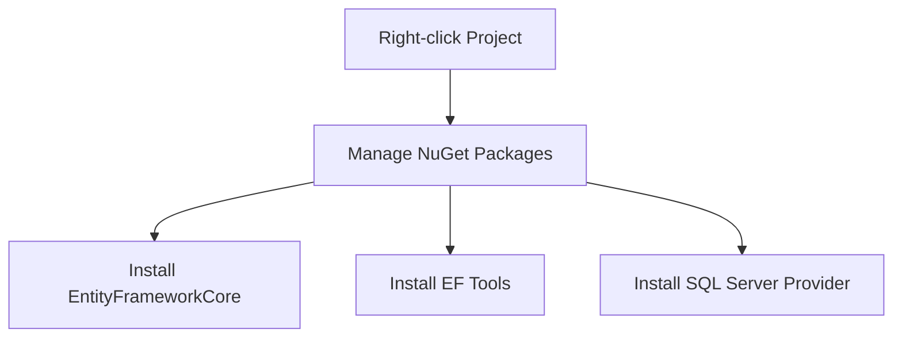

# Transitioning to SQL Database with Entity Framework Core

This guide explains how to transition from in-memory data storage to SQL Server using Entity Framework Core in our Polling Application.

## 🎯 Overview

We're moving our Poll management system from in-memory storage to a more persistent SQL Server database solution. This change will affect how we:
- Save Polls
- Select/Query Polls
- Update Poll data
- Delete Poll records

## 📦 Required Packages

| Package Name | Purpose | Notes |
|-------------|---------|-------|
| `Microsoft.EntityFrameworkCore` | Core EF functionality | Match version with your .NET version |
| `Microsoft.EntityFrameworkCore.Tools` | Migration support | Required for database migrations |
| `Microsoft.EntityFrameworkCore.SqlServer` | SQL Server provider | ⚠️ Use different provider if not using SQL Server |

## 🛠️ Installation Process



### Step-by-Step Installation

1. Open your project in Visual Studio
2. Right-click on the project in Solution Explorer
3. Select "Manage NuGet Packages"
4. Install each required package:
   ```
   Install-Package Microsoft.EntityFrameworkCore
   Install-Package Microsoft.EntityFrameworkCore.Tools
   Install-Package Microsoft.EntityFrameworkCore.SqlServer
   ```

## 📝 Version Compatibility

| .NET Version | EF Core Version |
|--------------|----------------|
| .NET 8.x     | EF Core 8.x    |
| .NET 7.x     | EF Core 7.x    |
| .NET 6.x     | EF Core 6.x    |

## ⚠️ Important Notes

- Always ensure package versions match your .NET version
- If using a different database:
  - Replace SQL Server provider with appropriate provider package
  - Example providers:
    - PostgreSQL: `Npgsql.EntityFrameworkCore.PostgreSQL`
    - MySQL: `Pomelo.EntityFrameworkCore.MySql`
    - SQLite: `Microsoft.EntityFrameworkCore.Sqlite`

## 🔜 Next Steps

After installing the packages:
1. Create Database Context
2. Configure Entity Models
3. Set up Migrations
4. Update Database

*Detailed instructions for these steps will be provided in subsequent updates.*

## 📈 Benefits of SQL Database Migration

- Persistent data storage
- Better data integrity
- Improved query performance
- Transaction support
- Concurrent access handling

---

**Note**: This documentation covers the initial setup phase. Further documentation will be provided for database context configuration and migration processes.
