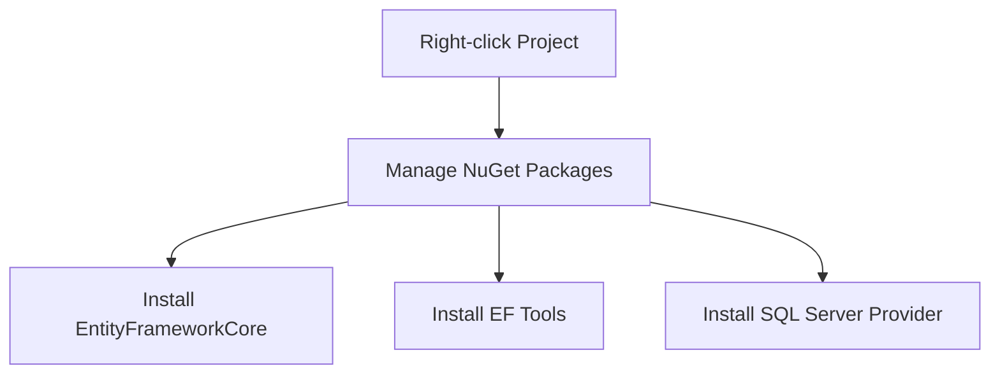
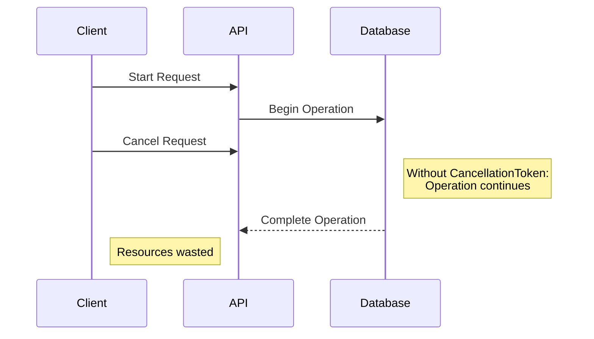
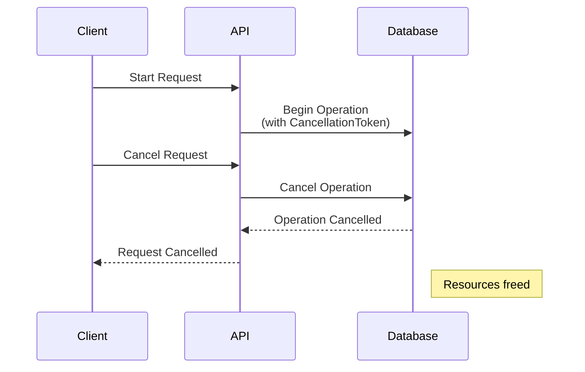
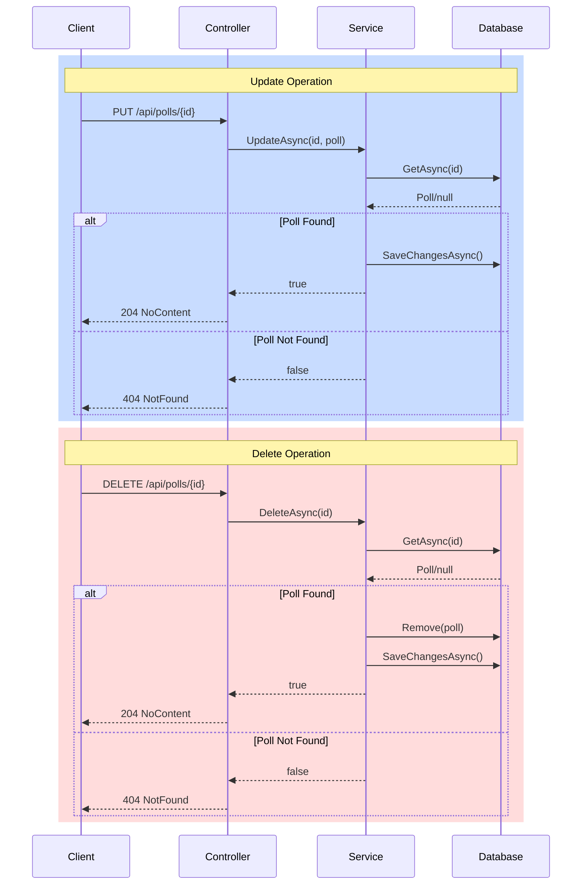
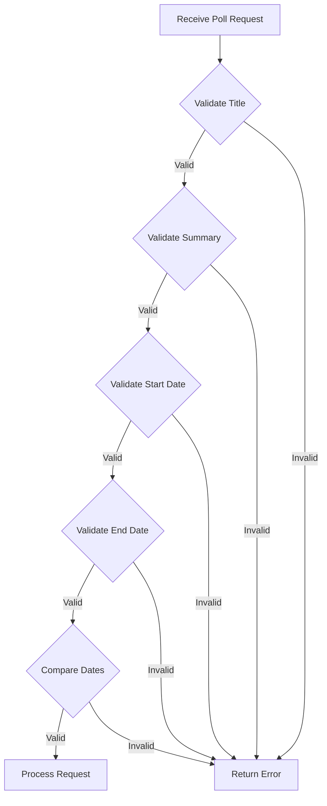

# Transitioning to SQL Database with Entity Framework Core

This guide explains how to transition from in-memory data storage to SQL Server using Entity Framework Core in our Polling Application.

## 🎯 Overview

We're moving our Poll management system from in-memory storage to a more persistent SQL Server database solution. This change will affect how we:
- Save Polls
- Select/Query Polls
- Update Poll data
- Delete Poll records

## 📦 Required Packages

| Package Name | Purpose | Notes |
|-------------|---------|-------|
| `Microsoft.EntityFrameworkCore` | Core EF functionality | Match version with your .NET version |
| `Microsoft.EntityFrameworkCore.Tools` | Migration support | Required for database migrations |
| `Microsoft.EntityFrameworkCore.SqlServer` | SQL Server provider | ⚠️ Use different provider if not using SQL Server |

## 🛠️ Installation Process



### Step-by-Step Installation

1. Open your project in Visual Studio
2. Right-click on the project in Solution Explorer
3. Select "Manage NuGet Packages"
4. Install each required package:
   ```
   Install-Package Microsoft.EntityFrameworkCore
   Install-Package Microsoft.EntityFrameworkCore.Tools
   Install-Package Microsoft.EntityFrameworkCore.SqlServer
   ```

## 📝 Version Compatibility

| .NET Version | EF Core Version |
|--------------|----------------|
| .NET 8.x     | EF Core 8.x    |
| .NET 7.x     | EF Core 7.x    |
| .NET 6.x     | EF Core 6.x    |

## ⚠️ Important Notes

- Always ensure package versions match your .NET version
- If using a different database:
  - Replace SQL Server provider with appropriate provider package
  - Example providers:
    - PostgreSQL: `Npgsql.EntityFrameworkCore.PostgreSQL`
    - MySQL: `Pomelo.EntityFrameworkCore.MySql`
    - SQLite: `Microsoft.EntityFrameworkCore.Sqlite`

## 🔜 Next Steps

After installing the packages:
1. Create Database Context
2. Configure Entity Models
3. Set up Migrations
4. Update Database

*Detailed instructions for these steps will be provided in subsequent updates.*

## 📈 Benefits of SQL Database Migration

- Persistent data storage
- Better data integrity
- Improved query performance
- Transaction support
- Concurrent access handling

---

**Note**: This documentation covers the initial setup phase. Further documentation will be provided for database context configuration and migration processes.


# Setting Up Database Context

## 📁 Project Structure
1. Create a new folder called `Persistence` for database-related code
2. Move/Rename `Models` folder to `Entities`

## 🗃️ Database Context Class

Create `ApplicationDbContext.cs` in the Persistence folder:

```csharp
public class ApplicationDbContext(DbContextOptions<ApplicationDbContext> options) : DbContext(options)
{
    public DbSet<Poll> Polls { get; set; }
}
```

## 📝 Entity Model
Update the Poll entity in `Entities` folder:

```csharp
public sealed class Poll
{
    public int Id { get; set; }
    public string Title { get; set; } = string.Empty;
    public string Summary { get; set; } = string.Empty;
    public bool IsPublished { get; set; }
    public DateOnly StartsAt { get; set; }
    public DateOnly EndsAt { get; set; }
}
```

## ⚙️ Configuration

### Connection String Setup
Add to `appsettings.json`:
```json
{
  "ConnectionStrings": {
    "DefaultConnection": "Server=(localdb)\\MSSQLLocalDB;Database=SurveyBasket;Trusted_Connection=True;Encrypt=False"
  }
}
```

### Dependency Injection Setup
Create a `DependencyInjection.cs` class:

```csharp
public static class DependencyInjection 
{
    public static IServiceCollection AddDependencies(
        this IServiceCollection services,
        IConfiguration configuration)
    {
        services.AddControllers();
        
        // Add database context
        var connectionString = configuration.GetConnectionString("DefaultConnection") 
            ?? throw new InvalidOperationException(
                "Connection string 'DefaultConnection' not found.");
                
        services.AddDbContext<ApplicationDbContext>(
            options => options.UseSqlServer(connectionString));

        // Add other services
        services
            .AddSwaggerServices()
            .AddMapsterconf()
            .AddFluentValidationConf();
            
        services.AddScoped<IPollService, PollService>();
        
        return services;
    }

    public static IServiceCollection AddSwaggerServices(
        this IServiceCollection services)
    {
        // Swagger configuration
        return services;
    }
}
```

### Optional: Separate Database Extension
You can extract database configuration to a separate extension method:

```csharp
public static class DatabaseExtensions
{
    public static IServiceCollection AddDatabase(
        this IServiceCollection services,
        IConfiguration configuration)
    {
        var connectionString = configuration.GetConnectionString("DefaultConnection");
        
        services.AddDbContext<ApplicationDbContext>(
            options => options.UseSqlServer(connectionString));
            
        return services;
    }
}
```

## 🔄 Program.cs Updates
Replace multiple service configurations with a single line:

```csharp
builder.Services.AddDependencies(builder.Configuration);
```

## 📋 Setup Checklist

- [ ] Create Persistence folder
- [ ] Rename Models to Entities
- [ ] Create ApplicationDbContext
- [ ] Update Poll entity
- [ ] Add connection string to appsettings.json
- [ ] Create DependencyInjection class
- [ ] Update Program.cs
- [ ] (Optional) Create separate database extensions

## ⚠️ Important Notes

1. Connection string server name can be found in SQL Server Object Explorer
2. Always validate connection string exists before using it
3. Poll class is marked as `sealed` as it won't be inherited
4. Using primary constructor syntax requires .NET 8+
5. Remember to handle null connection strings appropriately

## 🔜 Next Steps

1. Create initial migration
2. Update database schema
3. Implement repository pattern (optional)
4. Update services to use DbContext


# Entity Configuration and Migration Setup

## 🔑 Primary Key Conventions
Entity Framework Core automatically recognizes primary keys using these naming conventions:

| Convention | Example | Recommended |
|------------|---------|-------------|
| Property named `Id` | `public int Id { get; set; }` | ✅ |
| `{EntityName}Id` | `public int PollId { get; set; }` | ❌ |

## 🏗️ Entity Configuration Approaches

### Method 1: Data Annotations (Not Recommended)
```csharp
public class Poll
{
    [Key]
    public int Id { get; set; }
    
    [StringLength(100)]
    public string Title { get; set; }
    
    [MaxLength(100)]
    public string Summary { get; set; }
}
```

### Method 2: Fluent API (Recommended)
Create a dedicated configuration folder structure:
```
📁 Persistence/
    📁 EntityConfigurations/
        📄 PollConfiguration.cs
```

#### Configuration Class Example:
```csharp
public class PollConfiguration : IEntityTypeConfiguration<Poll>
{
    public void Configure(EntityTypeBuilder<Poll> builder)
    {
        // Unique constraint for Title
        builder.HasIndex(p => p.Title).IsUnique();
        
        // Maximum length constraints
        builder.Property(p => p.Title).HasMaxLength(100);
        builder.Property(p => p.Summary).HasMaxLength(100);
    }
}
```

## 📝 DbContext Configuration

### Option 1: Direct Configuration (Not Recommended)
```csharp
public class ApplicationDbContext : DbContext
{
    protected override void OnModelCreating(ModelBuilder modelBuilder)
    {
        modelBuilder.Entity<Poll>()
            .Property(p => p.Title)
            .HasMaxLength(100);
            
        base.OnModelCreating(modelBuilder);
    }
}
```

### Option 2: Using Configuration Classes (Recommended)
```csharp
public class ApplicationDbContext : DbContext
{
    protected override void OnModelCreating(ModelBuilder modelBuilder)
    {
        // Automatically apply all configurations in assembly
        modelBuilder.ApplyConfigurationsFromAssembly(
            Assembly.GetExecutingAssembly());
            
        base.OnModelCreating(modelBuilder);
    }
}
```

## 🔄 Migration Commands

| Command | Purpose | Example |
|---------|---------|---------|
| Add Migration | Create new migration | `Add-Migration InitialCreate -o Persistence/Migrations` |
| Remove Migration | Remove unapplied migration | `Remove-Migration` |
| Update Database | Apply migrations | `Update-Database` |

## 📋 Database Objects Created
After migration, two main objects are created:
1. `__EFMigrationsHistory` table - Tracks applied migrations
2. `Polls` table - Stores poll entities with configured constraints

## ⚡ Quick Setup Steps

1. Create Entity Configuration:
   ```csharp
   public class PollConfiguration : IEntityTypeConfiguration<Poll>
   {
       public void Configure(EntityTypeBuilder<Poll> builder)
       {
           builder.HasIndex(p => p.Title).IsUnique();
           builder.Property(p => p.Title).HasMaxLength(100);
           builder.Property(p => p.Summary).HasMaxLength(100);
       }
   }
   ```

2. Update DbContext:
   ```csharp
   protected override void OnModelCreating(ModelBuilder modelBuilder)
   {
       modelBuilder.ApplyConfigurationsFromAssembly(
           Assembly.GetExecutingAssembly());
       base.OnModelCreating(modelBuilder);
   }
   ```

3. Run Migrations:
   ```powershell
   Add-Migration InitialCreate -o Persistence/Migrations
   Update-Database
   ```

## 🔍 Best Practices

1. Use Fluent API over Data Annotations
2. Keep configurations in separate files
3. Use automatic configuration discovery
4. Place migrations in dedicated folder
5. Review migrations before applying

## ⚠️ Important Notes

- Always review generated migrations before applying
- Keep entity configurations focused and single-responsibility
- Use meaningful names for migrations
- Consider version control for migration scripts
- Test migrations in development before production

## 🔜 Next Steps

1. Implement repository pattern (optional)
2. Set up data seeding
3. Create database indexes
4. Implement audit fields


# Implementing Database-Driven Services

## 🔄 Service Interface Updates
Convert service operations to async:

```csharp
public interface IPollService
{
    Task<IEnumerable<Poll>> GetAllAsync();
    Task<Poll?> GetAsync(int id);
    Task<Poll> AddAsync(Poll poll);
    Task<bool> UpdateAsync(int id, Poll poll);
    Task<bool> DeleteAsync(int id);
}
```

## 💼 Service Implementation

```csharp
public class PollService(ApplicationDbContext dbContext) : IPollService
{
    private readonly ApplicationDbContext _dbContext = dbContext;

    public async Task<IEnumerable<Poll>> GetAllAsync()
        => await _dbContext.Polls.AsNoTracking().ToListAsync();

    public async Task<Poll?> GetAsync(int id)
        => await _dbContext.Polls.FindAsync(id);

    public async Task<Poll> AddAsync(Poll poll)
    {
        await _dbContext.AddAsync(poll);
        await _dbContext.SaveChangesAsync();
        return poll;
    }
}
```

> 💡 **Note**: `AsNoTracking()` is used to improve performance when we don't need to track entity changes.

## 🎮 Controller Updates
Updated controller with async operations:

```csharp
public class PollsController(IPollService pollService) : ControllerBase
{
    private readonly IPollService _pollService = pollService;

    [HttpGet("")]
    public async Task<IActionResult> GetAll()
    {
        var polls = await _pollService.GetAllAsync();
        var response = polls.Adapt<IEnumerable<PollResponse>>();
        return Ok(response);
    }

    [HttpGet("{id}")]
    public async Task<IActionResult> Get([FromRoute] int id)
    {
        var poll = await _pollService.GetAsync(id);
        if (poll is null)
            return NotFound();
        
        var response = poll.Adapt<PollResponse>();
        return Ok(response);
    }

    [HttpPost("")]
    public async Task<IActionResult> Add([FromBody] PollRequest request)
    {
        var newPoll = await _pollService.AddAsync(request.Adapt<Poll>());
        return CreatedAtAction(
            nameof(Get),
            new { id = newPoll.Id },
            newPoll);
    }
}
```

## 📝 DTOs (Data Transfer Objects)

### Response DTO
```csharp
public record PollResponse(
    int Id,
    string Title,
    string Summary,
    bool IsPublished,
    DateOnly StartsAt,
    DateOnly EndsAt
);
```

### Request DTO
```csharp
public record PollRequest(
    string Title,
    string Summary,
    bool IsPublished,
    DateOnly StartsAt,
    DateOnly EndsAt
);
```

## ✅ Validation

```csharp
public class PollRequestValidator : AbstractValidator<PollRequest>
{
    public PollRequestValidator()
    {
        RuleFor(pr => pr.Title)
            .NotEmpty()
            .Length(3, 100);

        RuleFor(pr => pr.Summary)
            .NotEmpty()
            .Length(3, 1500);
    }
}
```

## 📋 Implementation Checklist

- [ ] Update IPollService with async methods
- [ ] Implement PollService with database operations
- [ ] Update controller to use async operations
- [ ] Update DTOs with new properties
- [ ] Implement validation rules
- [ ] Test API endpoints

## 🔍 Key Points

1. **Async Operations**
   - All database operations are now async
   - Using Task<T> for asynchronous results
   - Proper async/await pattern implementation

2. **Entity Tracking**
   - Using `AsNoTracking()` for read-only operations
   - Improves performance for queries

3. **Response Structure**
   - CreatedAtAction returns proper location header
   - Consistent response formats
   - Proper error handling (NotFound)

4. **Validation**
   - Fluent Validation for request validation
   - Length constraints
   - Required field validation

## ⚠️ Important Notes

1. IsPublished is false by default
2. ID is auto-generated
3. SaveChangesAsync must be called after database modifications
4. Proper error handling should be implemented
5. Validation rules should match database constraints

## 🔜 Next Steps

1. Implement remaining CRUD operations
2. Add error handling middleware
3. Implement pagination
4. Add sorting and filtering
5. Implement caching (optional)
6. Add logging
7. Implement unit tests


# Handling Request Cancellation

## 🎯 The Problem
When a client cancels a request (by closing the browser, clicking cancel, etc.), the server might continue processing the request, leading to:
- Wasted server resources
- Unnecessary database operations
- Completed operations that the client no longer wants



## ✨ The Solution: CancellationToken

### 1. Update Service Interface
```csharp
public interface IPollService
{
    Task<IEnumerable<Poll>> GetAllAsync(CancellationToken cancellationToken = default);
    Task<Poll?> GetAsync(int id, CancellationToken cancellationToken = default);
    Task<Poll> AddAsync(Poll poll, CancellationToken cancellationToken = default);
    Task<bool> UpdateAsync(int id, Poll poll, CancellationToken cancellationToken = default);
    Task<bool> DeleteAsync(int id, CancellationToken cancellationToken = default);
}
```

### 2. Update Service Implementation
```csharp
public class PollService : IPollService
{
    public async Task<IEnumerable<Poll>> GetAllAsync(
        CancellationToken cancellationToken = default)
    {
        return await _dbContext.Polls
            .AsNoTracking()
            .ToListAsync(cancellationToken);
    }

    public async Task<Poll> AddAsync(
        Poll poll, 
        CancellationToken cancellationToken = default)
    {
        await _dbContext.AddAsync(poll, cancellationToken);
        await _dbContext.SaveChangesAsync(cancellationToken);
        return poll;
    }
}
```

### 3. Update Controller Actions
```csharp
public class PollsController : ControllerBase
{
    [HttpGet]
    public async Task<IActionResult> GetAll(
        CancellationToken cancellationToken)
    {
        var polls = await _pollService.GetAllAsync(cancellationToken);
        var response = polls.Adapt<IEnumerable<PollResponse>>();
        return Ok(response);
    }

    [HttpPost]
    public async Task<IActionResult> Add(
        [FromBody] PollRequest request,
        CancellationToken cancellationToken)
    {
        var newPoll = await _pollService.AddAsync(
            request.Adapt<Poll>(), 
            cancellationToken);
            
        return CreatedAtAction(
            nameof(Get),
            new { id = newPoll.Id },
            newPoll);
    }
}
```

## 🔄 How It Works



## 📋 Implementation Steps

1. Add CancellationToken parameter to:
   - [ ] Service interface methods
   - [ ] Service implementation methods
   - [ ] Controller actions

2. Pass CancellationToken to:
   - [ ] Database queries (`ToListAsync`, etc.)
   - [ ] Database commands (`SaveChangesAsync`, etc.)
   - [ ] Any other async operations

## ⚡ Benefits

- Improved resource utilization
- Better responsiveness to client cancellation
- Reduced server load
- Prevented unnecessary database operations
- Enhanced application reliability

## ⚠️ Important Notes

1. Default Value
   - Always provide default value: `CancellationToken cancellationToken = default`
   - Allows methods to be called without explicitly passing a token

2. Token Propagation
   - Pass the token through the entire call chain
   - Don't create new tokens unless necessary

3. Exception Handling
   - Handle `OperationCanceledException`
   - Properly clean up resources on cancellation

4. Performance Considerations
   - Minimal overhead when not cancelled
   - Significant resource savings when cancelled

## 🔍 Best Practices

1. Always pass the token to database operations
2. Implement cancellation support in long-running operations
3. Handle cancellation exceptions appropriately
4. Clean up resources in case of cancellation
5. Test cancellation scenarios

## 📚 Example Usage

```csharp
// In a long-running query
public async Task<List<Poll>> GetLargeDatasetAsync(
    CancellationToken cancellationToken)
{
    try
    {
        return await _dbContext.Polls
            .AsNoTracking()
            .Where(p => p.IsPublished)
            .ToListAsync(cancellationToken);
    }
    catch (OperationCanceledException)
    {
        // Handle cancellation
        throw;
    }
}
```

## 🔜 Next Steps

1. Implement timeout mechanisms
2. Add cancellation support to background tasks
3. Create cancellation policies
4. Add monitoring for cancelled operations
5. Implement retry mechanisms where appropriate


# Update and Delete Endpoints Implementation

## 🔄 Update Operation

### Service Implementation
```csharp
public async Task<bool> UpdateAsync(int id, Poll poll, 
    CancellationToken cancellationToken = default)
{
    var currentPoll = await GetAsync(id, cancellationToken);
    if (currentPoll is null)
        return false;
        
    currentPoll.Title = poll.Title;
    currentPoll.Summary = poll.Summary;
    currentPoll.StartsAt = poll.StartsAt;
    currentPoll.EndsAt = poll.EndsAt;
    
    await _dbContext.SaveChangesAsync(cancellationToken);
    return true;
}
```

### Controller Implementation
```csharp
[HttpPut("{id}")]
public async Task<IActionResult> Update(
    [FromRoute] int id,
    [FromBody] PollRequest request,
    CancellationToken cancellationToken)
{
    var isUpdated = await _pollService.UpdateAsync(
        id,
        request.Adapt<Poll>(),
        cancellationToken);

    if (!isUpdated)
        return NotFound();
        
    return NoContent();
}
```

## ❌ Delete Operation

### Service Implementation
```csharp
public async Task<bool> DeleteAsync(int id, 
    CancellationToken cancellationToken = default)
{
    var poll = await GetAsync(id, cancellationToken);
    if (poll is null)
        return false;
        
    _dbContext.Remove(poll);
    await _dbContext.SaveChangesAsync(cancellationToken);
    return true;
}
```

### Controller Implementation
```csharp
[HttpDelete("{id}")]
public async Task<IActionResult> Delete(
    [FromRoute] int id,
    CancellationToken cancellationToken)
{
    var isDeleted = await _pollService.DeleteAsync(id, cancellationToken);
    if (!isDeleted)
        return NotFound();
        
    return NoContent();
}
```

## 📊 Response Status Codes

| Operation | Success | Not Found | Description |
|-----------|---------|-----------|-------------|
| Update    | 204     | 404       | Returns NoContent on success |
| Delete    | 204     | 404       | Returns NoContent on success |

## 🔄 Operation Flow



## 🔍 Important Notes

1. **Update Operation**
   - Validates existence before update
   - Updates all provided fields
   - Returns 204 on success
   - Returns 404 if poll not found

2. **Delete Operation**
   - Validates existence before deletion
   - Performs physical deletion
   - Returns 204 on success
   - Returns 404 if poll not found

3. **Common Features**
   - Both operations support cancellation
   - Both use optimistic concurrency
   - Both handle non-existent resources

## ⚠️ Considerations

1. **Concurrency**
   - Consider adding concurrency tokens
   - Handle concurrent update conflicts

2. **Validation**
   - Add validation for update requests
   - Verify date ranges

3. **Soft Delete**
   - Consider implementing soft delete
   - Add IsDeleted flag if needed

4. **Audit Trail**
   - Consider logging changes
   - Track who made changes

## 🔜 Future Improvements

1. Add concurrency handling
2. Implement soft delete
3. Add audit trails
4. Add validation middleware
5. Implement event logging
6. Add transaction support
7. Implement bulk operations

## 📋 Testing Checklist

- [ ] Test successful update
- [ ] Test update with non-existent ID
- [ ] Test successful delete
- [ ] Test delete with non-existent ID
- [ ] Test cancellation scenarios
- [ ] Test concurrent operations
- [ ] Verify response status codes


# Custom Validation Rules Implementation

## 🎯 Business Rules
1. Start date cannot be in the past
2. End date must be after or equal to start date
3. Both dates are required

## ✨ Validator Implementation

```csharp
public class PollRequestValidator : AbstractValidator<PollRequest>
{
    public PollRequestValidator()
    {
        // Title validation
        RuleFor(pr => pr.Title)
            .NotEmpty()
            .Length(3, 100);

        // Summary validation
        RuleFor(pr => pr.Summary)
            .NotEmpty()
            .Length(3, 1500);

        // Start date validation
        RuleFor(pr => pr.StartsAt)
            .NotEmpty()
            .GreaterThanOrEqualTo(DateOnly.FromDateTime(DateTime.Today));

        // End date validation
        RuleFor(pr => pr.EndsAt)
            .NotEmpty();

        // Custom date range validation
        RuleFor(pr => pr)
            .Must(HasValidDates)
            .WithName(nameof(PollRequest.EndsAt))
            .WithMessage("{PropertyName} must be greater than or equal to start date");
    }

    private bool HasValidDates(PollRequest request)
        => request.EndsAt >= request.StartsAt;
}
```

## 🔄 Validation Flow



## 📋 Validation Rules Breakdown

### Title Rules
```csharp
RuleFor(pr => pr.Title)
    .NotEmpty()
    .Length(3, 100);
```
- Must not be empty
- Length between 3 and 100 characters

### Summary Rules
```csharp
RuleFor(pr => pr.Summary)
    .NotEmpty()
    .Length(3, 1500);
```
- Must not be empty
- Length between 3 and 1500 characters

### Start Date Rules
```csharp
RuleFor(pr => pr.StartsAt)
    .NotEmpty()
    .GreaterThanOrEqualTo(DateOnly.FromDateTime(DateTime.Today));
```
- Must not be empty
- Must be today or in the future

### End Date Rules
```csharp
RuleFor(pr => pr.EndsAt)
    .NotEmpty();

RuleFor(pr => pr)
    .Must(HasValidDates)
    .WithName(nameof(PollRequest.EndsAt))
    .WithMessage("{PropertyName} must be greater than or equal to start date");
```
- Must not be empty
- Must be greater than or equal to start date

## 🎭 Example Scenarios

| Scenario | Start Date | End Date | Valid | Reason |
|----------|------------|----------|-------|---------|
| Past Start | 2024-03-01 | 2024-04-01 | ❌ | Start date in past |
| Invalid Range | 2024-04-03 | 2024-04-01 | ❌ | End before start |
| Valid Range | 2024-04-01 | 2024-04-03 | ✅ | Valid dates |
| Same Day | 2024-04-01 | 2024-04-01 | ✅ | Valid (equal dates) |

## ⚡ Key Features

1. **Cross-property Validation**
   - Uses `Must()` for custom validation logic
   - Compares multiple properties in single validation

2. **Custom Error Messages**
   - Uses property name in error message
   - Clear, user-friendly error descriptions

3. **Business Logic Enforcement**
   - Prevents invalid date ranges
   - Ensures future-dated polls

## ⚠️ Important Notes

1. Date Validation
   - Uses `DateOnly` for date comparison
   - Excludes time component
   - Handles timezone considerations

2. Error Messages
   - Custom formatted messages
   - Property name included automatically
   - Localizable error messages

## 🔜 Possible Improvements

1. Add maximum date range validation
2. Implement custom date formats
3. Add timezone support
4. Create localized error messages
5. Add business hours validation
6. Implement holiday checking
7. Add batch validation support

## 📋 Testing Checklist

- [ ] Test past start dates
- [ ] Test invalid date ranges
- [ ] Test equal start and end dates
- [ ] Test valid future dates
- [ ] Test empty dates
- [ ] Test error messages
- [ ] Test edge cases
