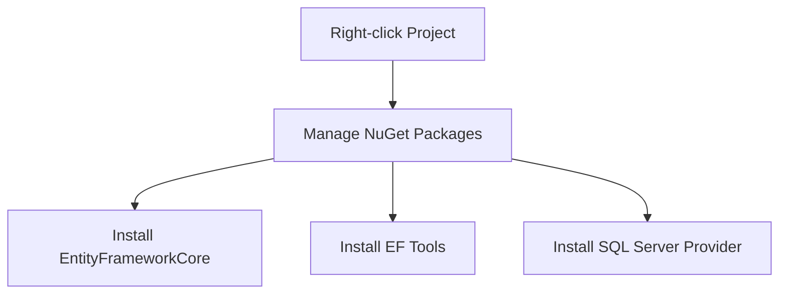

# Transitioning to SQL Database with Entity Framework Core

This guide explains how to transition from in-memory data storage to SQL Server using Entity Framework Core in our Polling Application.

## 🎯 Overview

We're moving our Poll management system from in-memory storage to a more persistent SQL Server database solution. This change will affect how we:
- Save Polls
- Select/Query Polls
- Update Poll data
- Delete Poll records

## 📦 Required Packages

| Package Name | Purpose | Notes |
|-------------|---------|-------|
| `Microsoft.EntityFrameworkCore` | Core EF functionality | Match version with your .NET version |
| `Microsoft.EntityFrameworkCore.Tools` | Migration support | Required for database migrations |
| `Microsoft.EntityFrameworkCore.SqlServer` | SQL Server provider | ⚠️ Use different provider if not using SQL Server |

## 🛠️ Installation Process



### Step-by-Step Installation

1. Open your project in Visual Studio
2. Right-click on the project in Solution Explorer
3. Select "Manage NuGet Packages"
4. Install each required package:
   ```
   Install-Package Microsoft.EntityFrameworkCore
   Install-Package Microsoft.EntityFrameworkCore.Tools
   Install-Package Microsoft.EntityFrameworkCore.SqlServer
   ```

## 📝 Version Compatibility

| .NET Version | EF Core Version |
|--------------|----------------|
| .NET 8.x     | EF Core 8.x    |
| .NET 7.x     | EF Core 7.x    |
| .NET 6.x     | EF Core 6.x    |

## ⚠️ Important Notes

- Always ensure package versions match your .NET version
- If using a different database:
  - Replace SQL Server provider with appropriate provider package
  - Example providers:
    - PostgreSQL: `Npgsql.EntityFrameworkCore.PostgreSQL`
    - MySQL: `Pomelo.EntityFrameworkCore.MySql`
    - SQLite: `Microsoft.EntityFrameworkCore.Sqlite`

## 🔜 Next Steps

After installing the packages:
1. Create Database Context
2. Configure Entity Models
3. Set up Migrations
4. Update Database

*Detailed instructions for these steps will be provided in subsequent updates.*

## 📈 Benefits of SQL Database Migration

- Persistent data storage
- Better data integrity
- Improved query performance
- Transaction support
- Concurrent access handling

---

**Note**: This documentation covers the initial setup phase. Further documentation will be provided for database context configuration and migration processes.


# Setting Up Database Context

## 📁 Project Structure
1. Create a new folder called `Persistence` for database-related code
2. Move/Rename `Models` folder to `Entities`

## 🗃️ Database Context Class

Create `ApplicationDbContext.cs` in the Persistence folder:

```csharp
public class ApplicationDbContext(DbContextOptions<ApplicationDbContext> options) : DbContext(options)
{
    public DbSet<Poll> Polls { get; set; }
}
```

## 📝 Entity Model
Update the Poll entity in `Entities` folder:

```csharp
public sealed class Poll
{
    public int Id { get; set; }
    public string Title { get; set; } = string.Empty;
    public string Summary { get; set; } = string.Empty;
    public bool IsPublished { get; set; }
    public DateOnly StartsAt { get; set; }
    public DateOnly EndsAt { get; set; }
}
```

## ⚙️ Configuration

### Connection String Setup
Add to `appsettings.json`:
```json
{
  "ConnectionStrings": {
    "DefaultConnection": "Server=(localdb)\\MSSQLLocalDB;Database=SurveyBasket;Trusted_Connection=True;Encrypt=False"
  }
}
```

### Dependency Injection Setup
Create a `DependencyInjection.cs` class:

```csharp
public static class DependencyInjection 
{
    public static IServiceCollection AddDependencies(
        this IServiceCollection services,
        IConfiguration configuration)
    {
        services.AddControllers();
        
        // Add database context
        var connectionString = configuration.GetConnectionString("DefaultConnection") 
            ?? throw new InvalidOperationException(
                "Connection string 'DefaultConnection' not found.");
                
        services.AddDbContext<ApplicationDbContext>(
            options => options.UseSqlServer(connectionString));

        // Add other services
        services
            .AddSwaggerServices()
            .AddMapsterconf()
            .AddFluentValidationConf();
            
        services.AddScoped<IPollService, PollService>();
        
        return services;
    }

    public static IServiceCollection AddSwaggerServices(
        this IServiceCollection services)
    {
        // Swagger configuration
        return services;
    }
}
```

### Optional: Separate Database Extension
You can extract database configuration to a separate extension method:

```csharp
public static class DatabaseExtensions
{
    public static IServiceCollection AddDatabase(
        this IServiceCollection services,
        IConfiguration configuration)
    {
        var connectionString = configuration.GetConnectionString("DefaultConnection");
        
        services.AddDbContext<ApplicationDbContext>(
            options => options.UseSqlServer(connectionString));
            
        return services;
    }
}
```

## 🔄 Program.cs Updates
Replace multiple service configurations with a single line:

```csharp
builder.Services.AddDependencies(builder.Configuration);
```

## 📋 Setup Checklist

- [ ] Create Persistence folder
- [ ] Rename Models to Entities
- [ ] Create ApplicationDbContext
- [ ] Update Poll entity
- [ ] Add connection string to appsettings.json
- [ ] Create DependencyInjection class
- [ ] Update Program.cs
- [ ] (Optional) Create separate database extensions

## ⚠️ Important Notes

1. Connection string server name can be found in SQL Server Object Explorer
2. Always validate connection string exists before using it
3. Poll class is marked as `sealed` as it won't be inherited
4. Using primary constructor syntax requires .NET 8+
5. Remember to handle null connection strings appropriately

## 🔜 Next Steps

1. Create initial migration
2. Update database schema
3. Implement repository pattern (optional)
4. Update services to use DbContext


# Entity Configuration and Migration Setup

## 🔑 Primary Key Conventions
Entity Framework Core automatically recognizes primary keys using these naming conventions:

| Convention | Example | Recommended |
|------------|---------|-------------|
| Property named `Id` | `public int Id { get; set; }` | ✅ |
| `{EntityName}Id` | `public int PollId { get; set; }` | ❌ |

## 🏗️ Entity Configuration Approaches

### Method 1: Data Annotations (Not Recommended)
```csharp
public class Poll
{
    [Key]
    public int Id { get; set; }
    
    [StringLength(100)]
    public string Title { get; set; }
    
    [MaxLength(100)]
    public string Summary { get; set; }
}
```

### Method 2: Fluent API (Recommended)
Create a dedicated configuration folder structure:
```
📁 Persistence/
    📁 EntityConfigurations/
        📄 PollConfiguration.cs
```

#### Configuration Class Example:
```csharp
public class PollConfiguration : IEntityTypeConfiguration<Poll>
{
    public void Configure(EntityTypeBuilder<Poll> builder)
    {
        // Unique constraint for Title
        builder.HasIndex(p => p.Title).IsUnique();
        
        // Maximum length constraints
        builder.Property(p => p.Title).HasMaxLength(100);
        builder.Property(p => p.Summary).HasMaxLength(100);
    }
}
```

## 📝 DbContext Configuration

### Option 1: Direct Configuration (Not Recommended)
```csharp
public class ApplicationDbContext : DbContext
{
    protected override void OnModelCreating(ModelBuilder modelBuilder)
    {
        modelBuilder.Entity<Poll>()
            .Property(p => p.Title)
            .HasMaxLength(100);
            
        base.OnModelCreating(modelBuilder);
    }
}
```

### Option 2: Using Configuration Classes (Recommended)
```csharp
public class ApplicationDbContext : DbContext
{
    protected override void OnModelCreating(ModelBuilder modelBuilder)
    {
        // Automatically apply all configurations in assembly
        modelBuilder.ApplyConfigurationsFromAssembly(
            Assembly.GetExecutingAssembly());
            
        base.OnModelCreating(modelBuilder);
    }
}
```

## 🔄 Migration Commands

| Command | Purpose | Example |
|---------|---------|---------|
| Add Migration | Create new migration | `Add-Migration InitialCreate -o Persistence/Migrations` |
| Remove Migration | Remove unapplied migration | `Remove-Migration` |
| Update Database | Apply migrations | `Update-Database` |

## 📋 Database Objects Created
After migration, two main objects are created:
1. `__EFMigrationsHistory` table - Tracks applied migrations
2. `Polls` table - Stores poll entities with configured constraints

## ⚡ Quick Setup Steps

1. Create Entity Configuration:
   ```csharp
   public class PollConfiguration : IEntityTypeConfiguration<Poll>
   {
       public void Configure(EntityTypeBuilder<Poll> builder)
       {
           builder.HasIndex(p => p.Title).IsUnique();
           builder.Property(p => p.Title).HasMaxLength(100);
           builder.Property(p => p.Summary).HasMaxLength(100);
       }
   }
   ```

2. Update DbContext:
   ```csharp
   protected override void OnModelCreating(ModelBuilder modelBuilder)
   {
       modelBuilder.ApplyConfigurationsFromAssembly(
           Assembly.GetExecutingAssembly());
       base.OnModelCreating(modelBuilder);
   }
   ```

3. Run Migrations:
   ```powershell
   Add-Migration InitialCreate -o Persistence/Migrations
   Update-Database
   ```

## 🔍 Best Practices

1. Use Fluent API over Data Annotations
2. Keep configurations in separate files
3. Use automatic configuration discovery
4. Place migrations in dedicated folder
5. Review migrations before applying

## ⚠️ Important Notes

- Always review generated migrations before applying
- Keep entity configurations focused and single-responsibility
- Use meaningful names for migrations
- Consider version control for migration scripts
- Test migrations in development before production

## 🔜 Next Steps

1. Implement repository pattern (optional)
2. Set up data seeding
3. Create database indexes
4. Implement audit fields
